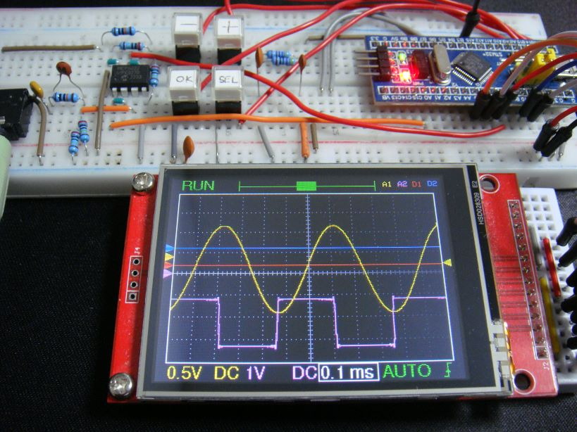
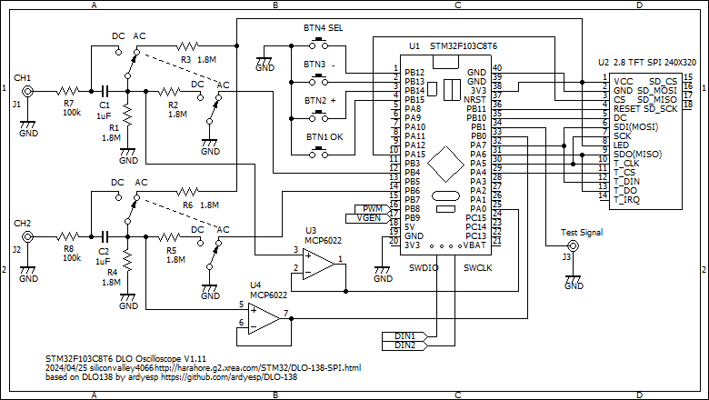

# DLO-138-SPI
An open source firmware for DSO-138 Oscilloscope for STM32F103C8T6 Blue Pill and SPI TFT display. 

This is a modification to the DLO-138 for the so called Blue Pill STM32F103C8T6 bord and SPI TFT 320x240 display.
DSO-138 is an excellent piece of hardware based on ARM Cortex M3 core STM32F103 processor and sufficient for most beginner users. The stock firmware, while quite responsive, can use a few improvements. The main shortcoming which prompted the development of DLO-138 firmware is the inability to get waveform data into a computer for further analysis and the lack of a second channel. Engineers troubleshooting hardware issues need to mark reference points on waveform so having another analog or digital channel can greatly improve analysis. This firmware hopes to improve on these issues.

## Features
- Two analog channels
- Two digital logic channels (SWDIO and SWCLK pins (PA13 and PA14) on board)
- Serial port interface for captured waveform data
- Option to use rotary encoder instead of + - and SEL switches
- 2K sample depth

This firmware can NOT be used on stock DSO-138 hardware. We can build the hardware using stock STM32F103CC8T6 bord and a SPI TFT display.

# Cost
You need not to have the DSO-138. Instead you can build the hardware on the breadboard or create original PCB. In the case of DLO-138, it is the loss of lowest timebase. Maximum sampling rate in DLO-138 is 20 µs/div instead of 10 µs/div. In the 20 µs/div range, firmware under-samples ADC channels, often reading same data twice. To use the second analog channel, analog front end has to be duplicated on a daughter board. On a stock hardware, this firmware can be used to provide two digital logic channels.

In the case of DLO-138-SPI, the frontend input circuit is simplified for ease of build. It can't accept negative voltage, and the voltage range is fixed to 0.5V/div only. AC mode is not implemented yet.
Furthermore, a comparator for trigger detection have been omitted so that the ability of pre-trigger viewing is not available.

# Build
The build environment uses Arduino. For help with setting up IDE visit http://www.stm32duino.com

For graphics output, this project depends on the Adafruit GFX Library v1.11.9.
Install it via the Library Manager of your Arduino IDE.
Other/newer versions of this library are likely to not compile or will give you a black screen.

# Hardware
Circuit diagram is as follows:

# Usage:
	Push button in encoder (SEL if using switches) moves focus to next parameter
	Left/Right turn in encoder (+/- if using switches) changes the parameter which is in focus
	Short press OK to HOLD the waveform and output it on serial port
 	At wave selection, + button rotates all the combination of A2 D1 D3. A1 is always active.
	Long press OK button:
	
		Focus				Action
		Trigger Level		Zero the trigger level to Analog channel 1
		Wave X scrollbar	Beginning of waveform on screen (at trigger point)
		Wave Y cursor		Zero the cursor. If Analog CH1 coupling is GND, waveform reference base is set 
		Other			Toggle on screen Analog CH1 statistics display

	Press and hold OK button at power up to reset settings to default

# References
DSO-138 - http://www.jyetech.com/Products/LcdScope/e138.php

STM32Duino - http://www.stm32duino.com

STM32F103 - http://www.st.com/en/microcontrollers/stm32f103.html

Adafruint Graphics Library - https://github.com/adafruit/Adafruit-GFX-Library

Adafruit ILI9341 Arduino Library - https://github.com/adafruit/Adafruit_ILI9341

